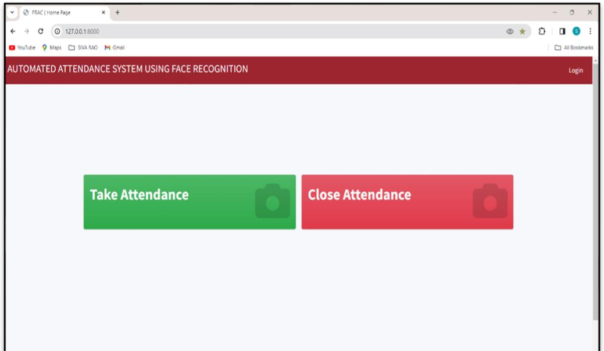
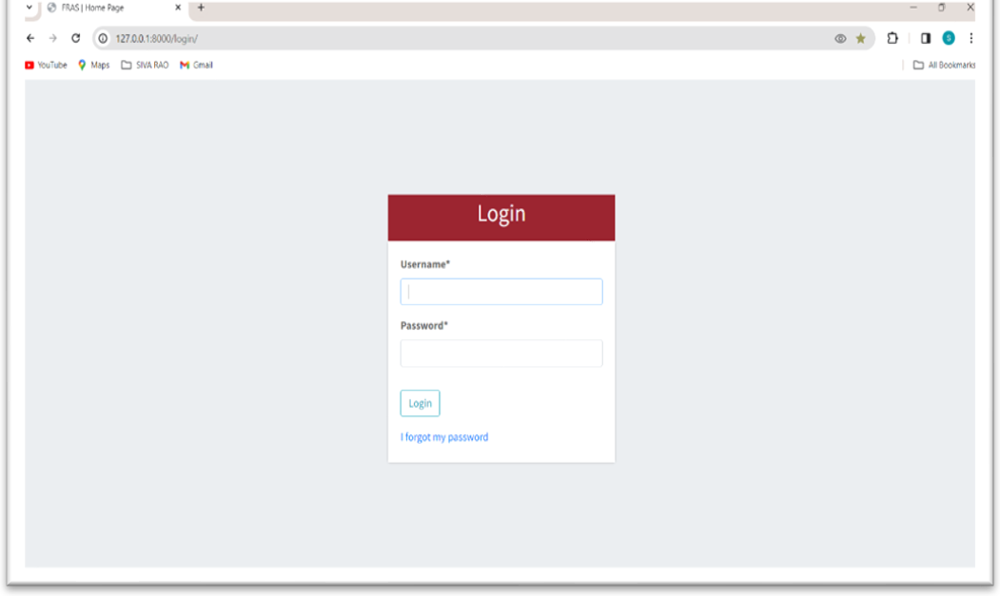
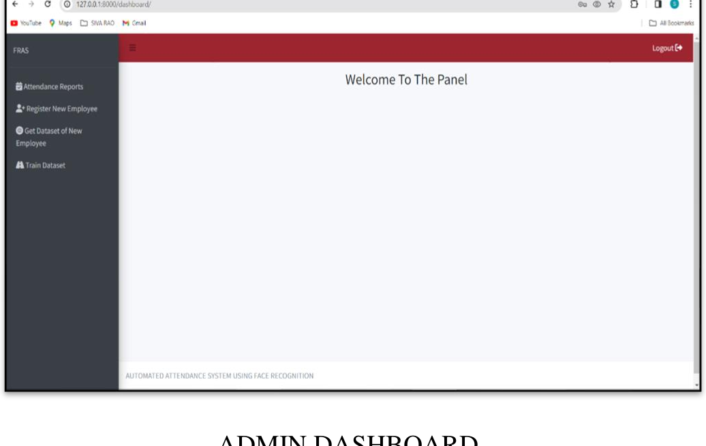
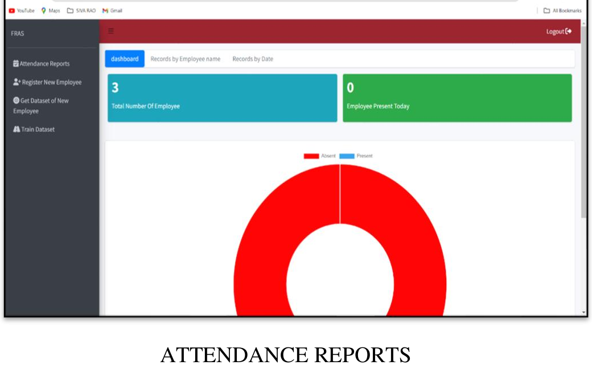
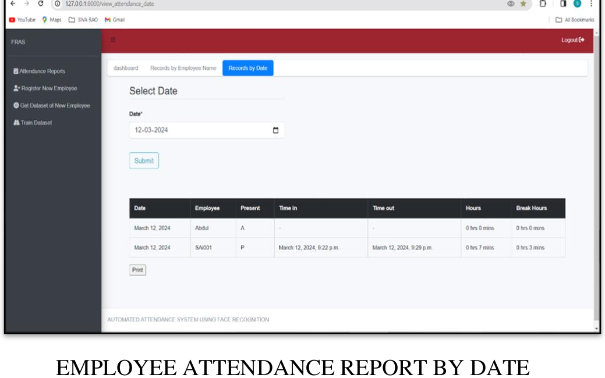
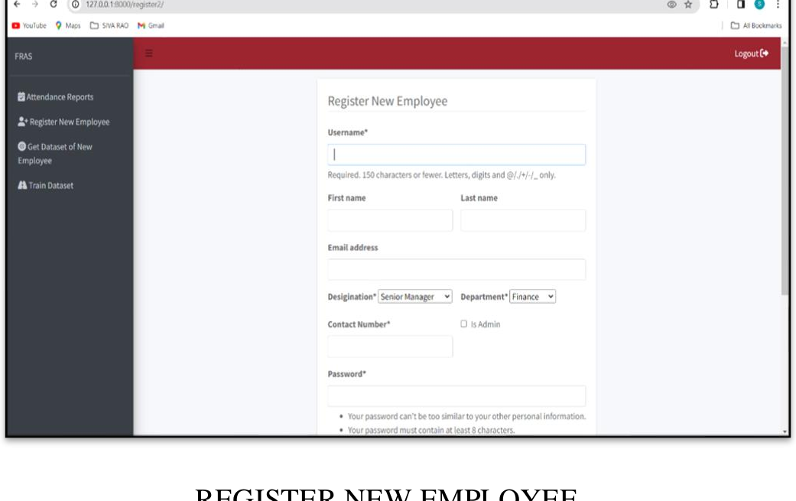
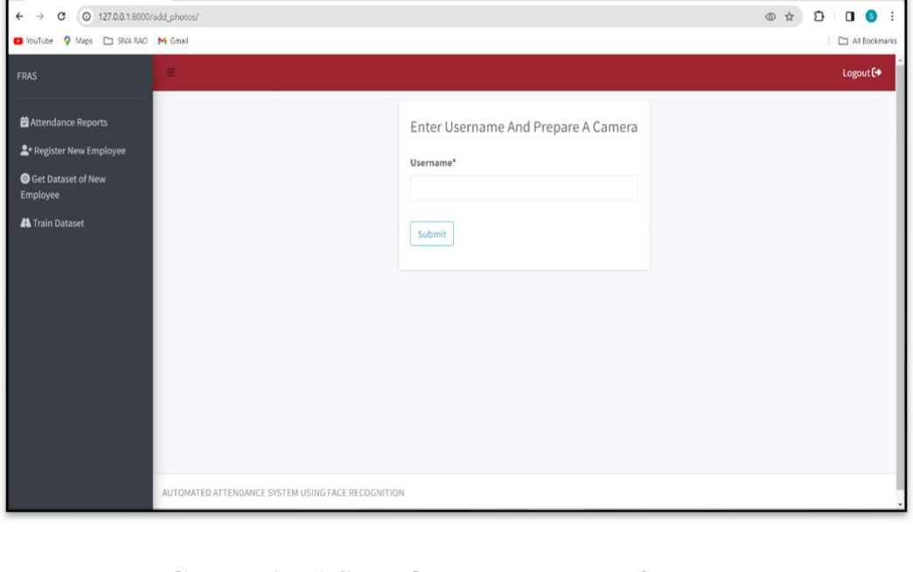
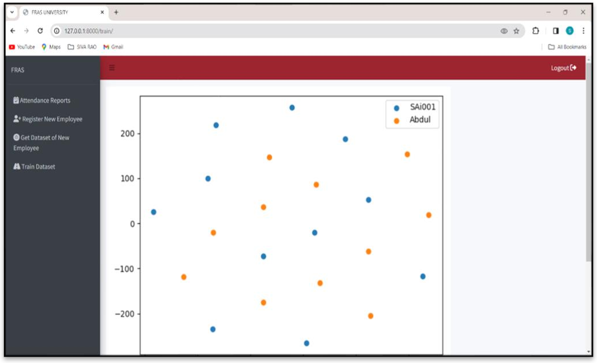
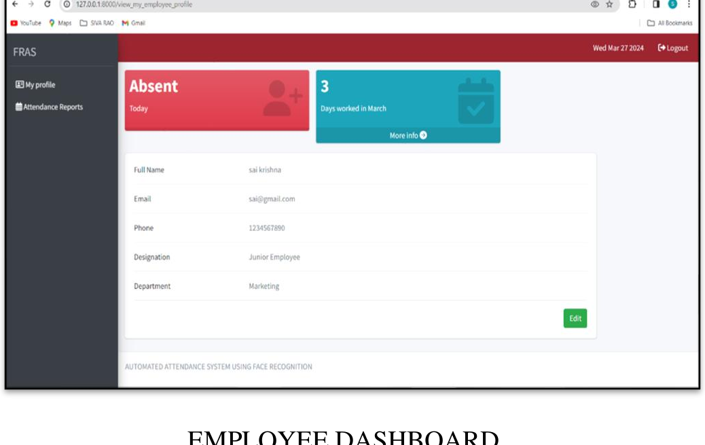
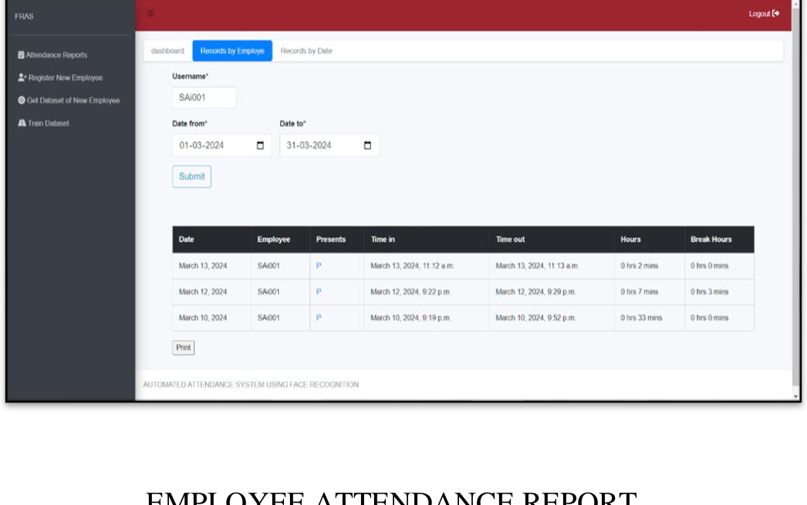

# FRAS — Automated Attendance System Using Face Recognition

A full-stack web application that replaces manual, paper-based attendance registers with **face-recognition-based attendance system**. Employees are marked "in", on a "break", or "out" simply by looking at a webcam.

Built with **Python, Django, OpenCV, dlib (HOG-based face detector) and scikit-learn**, with a Bootstrap front end and Chart.js-powered visual attendance reports.

> Final-year BCA project (Dec 2023 – Apr 2024)
> 
## Table of Contents

- [Overview](#overview)
- [Key Features](#key-features)
- [Tech Stack](#tech-stack)
- [System Architecture](#system-architecture)
- [Screenshots](#screenshots)
- [Project Structure](#project-structure)
- [Getting Started](#getting-started)
- [Usage Guide](#usage-guide)
- [Testing](#testing)
- [Limitations](#limitations)
- [Future Scope](#future-scope)
- [References](#references)
- [Author](#author)

---

## Overview

Traditional attendance systems — paper registers, punch cards, manual spreadsheets — are slow, error-prone, and easy to manipulate (proxy attendance, lost records, no real-time visibility). **FRAS** digitizes the entire process:

1. An employee's face is registered and a training dataset of their face is captured through the webcam.
2. A classifier (SVM, via scikit-learn) is trained on the collected face-encodings (generated using `dlib` / HOG — Histogram of Oriented Gradients).
3. At the start/end of the day, the employee simply looks at the webcam on the **Take Attendance** / **Close Attendance** page; the system recognizes them and logs the timestamp automatically.
4. Admins and employees can view attendance history, hours worked, and break durations through interactive dashboards.

## Key Features

- **Face-recognition attendance marking** — webcam-based check-in / check-out, no manual entry.
- **Automatic In-Time / Out-Time / Break-Time logging** with total hours worked per day.
- **Admin panel**
  - Register new employees (username, name, email, designation, department, contact).
  - Capture a training-photo dataset for a new employee directly from the browser.
  - Train the recognition model (SVM classifier) on the captured dataset.
  - View organization-wide attendance reports — by date or by employee — with present/absent doughnut charts.
- **Employee self-service dashboard**
  - View personal profile and attendance summary ("Days worked this month", "Absent today", etc.).
  - Filter personal attendance history by a custom date range.
- **Data visualization** — present/absent charts, hours-vs-date and hours-vs-employee graphs (Chart.js + Matplotlib).
- **Authentication** — Django's built-in auth system with login/logout and password reset.

## Tech Stack

| Layer | Technology |
|---|---|
| Backend | Python 3.8, Django 3.1 |
| Face Detection / Recognition | dlib (HOG-based detector), `face_recognition`, OpenCV |
| Machine Learning | scikit-learn (SVM classifier), NumPy, joblib |
| Data & Reporting | pandas, django-pandas, Matplotlib, seaborn |
| Frontend | HTML, Bootstrap, django-crispy-forms, Chart.js |
| Database | SQLite (default, swappable for PostgreSQL/MySQL in production) |
| Algorithm | HOG (Histogram of Oriented Gradients) for face detection & encoding |

Full dependency list: [`requirements.txt`](./requirements.txt)

## System Architecture

```
                      ┌─────────────────────┐
   Webcam Feed  ───▶  │  OpenCV Face Capture │
                      └──────────┬──────────┘
                                 │ face encodings (dlib HOG)
                                 ▼
                      ┌─────────────────────┐
                      │  SVM Classifier      │◀── trained on
                      │  (scikit-learn)      │    employee photo dataset
                      └──────────┬──────────┘
                                 │ predicted identity
                                 ▼
                      ┌─────────────────────┐        ┌────────────────┐
                      │  Django Views/Models │──────▶ │ SQLite Database │
                      │  (attendance app)    │        └────────────────┘
                      └──────────┬──────────┘
                                 │
                                 ▼
                      ┌─────────────────────┐
                      │ Bootstrap + Chart.js │
                      │  Dashboards / Reports│
                      └─────────────────────┘
```

**Django apps**
- `attendance/` — core app: face capture, training, recognition, marking attendance, admin & employee reports.
- `users/` — authentication (login, logout, password reset).
- `FRAS/` — project settings, URL routing, WSGI/ASGI config.

## Screenshots

| Home Page | Login Page |
|---|---|
|  |  |

| Admin Dashboard | Attendance Reports |
|---|---|
|  |  |

| Attendance Report by Date | Register New Employee |
|---|---|
|  |  |

| Get Employee Face Dataset | Train Dataset |
|---|---|
|  |  |

| Employee Dashboard | Employee Attendance Report |
|---|---|
|  |  |

*(Screenshots are from the original project report/demo run.)*

## Project Structure

```
FRAS/
├── attendance/                  # Core app — face capture, training, recognition, reports
│   ├── migrations/
│   ├── static/recognition/      # CSS/JS/images, generated attendance graphs
│   ├── templates/recognition/   # HTML templates
│   ├── forms.py
│   ├── models.py
│   └── views.py
├── users/                       # Authentication app
│   ├── migrations/
│   ├── templates/users/
│   └── views.py
├── FRAS/                        # Project config
│   ├── settings.py
│   ├── urls.py
│   └── wsgi.py / asgi.py
├── face_recognition_data/       # Generated at runtime (see face_recognition_data/README.md)
│   └── training_dataset/
├── docs/screenshots/            # README screenshots
├── manage.py
├── requirements.txt
└── README.md
```

## Getting Started

### Prerequisites

- Python 3.8 (dlib/face_recognition wheels are most reliable on 3.8; newer versions may need dlib built from source)
- `pip`, and (on Windows) **CMake** + **Visual Studio Build Tools** to compile `dlib`
- A webcam (for capturing/registering faces and marking attendance)

### Installation

```bash
# 1. Clone the repository
git clone https://github.com/<your-username>/FRAS.git
cd FRAS

# 2. Create and activate a virtual environment
python -m venv venv
# Windows:
venv\Scripts\activate
# macOS/Linux:
source venv/bin/activate

# 3. Install dependencies
pip install -r requirements.txt

# 4. Download the dlib facial-landmark model (~96 MB, not included in this repo)
# Download from: http://dlib.net/files/shape_predictor_68_face_landmarks.dat.bz2
# Extract it and place shape_predictor_68_face_landmarks.dat inside face_recognition_data/

# 5. Apply database migrations
python manage.py migrate

# 6. Create a superuser (admin login)
python manage.py createsuperuser

# 7. Run the development server
python manage.py runserver
```

Visit **http://127.0.0.1:8000/** in your browser.

> See [`face_recognition_data/README.md`](face_recognition_data/README.md) for details on why the trained model, face-landmark file, and training photos are excluded from this repository.

## Usage Guide

1. **Log in** as admin (superuser created above).
2. **Register New Employee** — enter the employee's details (username, name, email, designation, department).
3. **Get Dataset of New Employee** — enter the employee's username and capture face images via webcam (used for training).
4. **Train Dataset** — trains the SVM classifier on all captured face data.
5. **Take Attendance / Close Attendance** (from the Home page) — employees look at the webcam to mark in-time / out-time.
6. **Attendance Reports** (admin) — view records by date or by employee, with present/absent visualizations.
7. **Employee Dashboard** — employees log in to view their own profile and attendance history.

## Testing

The project was validated using:
- **Black-box testing** — login, registration, and attendance-viewing flows tested against valid/invalid inputs.
- **White-box testing** — internal decision flow of the face-recognition → database-check → in/break/out-time logic.
- **Unit, integration, system, and functional testing** covering individual modules and the end-to-end workflow.

## Limitations

- Attendance can currently be marked by showing a photo of an employee to the webcam (no liveness detection).
- ~300 images per employee are captured for accuracy, which becomes storage-heavy at scale.
- Training the classifier takes ~20 seconds per employee, which doesn't scale efficiently for large organizations.

## Future Scope

- Liveness/anti-spoofing detection and intruder alerts for unrecognized faces.
- Incremental training (retrain only on newly added images instead of the full dataset).
- Feedback loop to correct misclassified faces and improve model accuracy over time.
- Geolocation/geofencing for remote or field-based attendance verification.
- Integration with HR and payroll systems for automated payroll and leave management.

## References

- [Django Documentation](https://www.djangoproject.com/)
- [dlib](http://dlib.net/)
- [OpenCV](https://opencv.org/)
- [Bootstrap](https://getbootstrap.com/)
- [Face Recognition Attendance System — Analytics Vidhya](https://www.analyticsvidhya.com/blog/2021/11/build-face-recognition-attendance-system-using-python/)

## Author

**S Sai Krishna**
Bachelor of Computer Applications, 2024
📧 sai2002siva@gmail.com · 🔗 [LinkedIn](https://www.linkedin.com/in/s-sai-krishna21)
---
